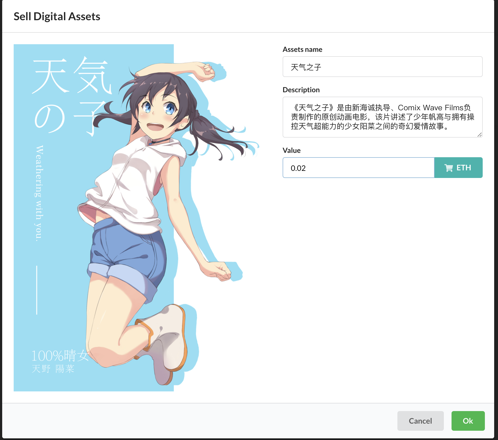
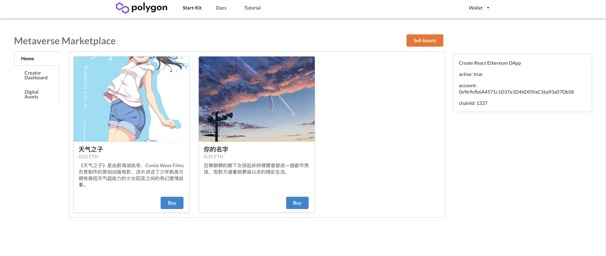
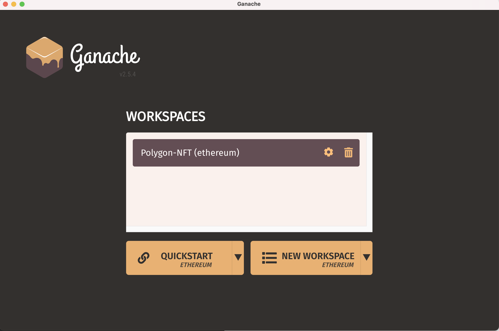

<div align=center> 

</div>

<center> Starter Kits 快速构建 DAPP </center>

<center> An Polygon Starter Kit Tutorial containing React, @web3-react, Infura. </center>
<div align=center> <a href="https://docs.matic.network/docs/develop/getting-started"> Developer Docs</a> - <a href="https://polygon-tutorial.solidstake.net/shelves/tutorial"> Tutorial </a></div>    


## Metaverse Marketplace
> Refer: https://github.com/dabit3/polygon-ethereum-nextjs-marketplace

##### 项目截图：





##### 项目地址：
[Polygon-Academy nft-tutorial](https://github.com/Polygon-Academy/nft-tutorial.git)

## 0. 使用 starter kit 创建项目
```javascripts
npx create-react-app metaverse --template polygon-starter-kit
cd metaverse
npm run start 
```


#### 创建 Ganache Workspace


##### 设置
指定 `workshop` 的 `turffle-config.js` 为上一步创建的 `metaverse/truffle-config.js`

 在 `SERVE`  中设置 `chainId = 1337`、`portNumber = 8545`
 
 

##### 创建`.env` , 配置 truffle

启动后会生成设置 `eth` 钱包地址，导出私钥

```javascripts
vim .env 

# truffle-config
MNEMONIC="{Ganache Mnemonic Or PrivateKey}"
POLYGON_RPC="https://rpc-mainnet.matic.network"
POLYGON_MUMBAI_RPC="https://rpc-mumbai.maticvigil.com"

# infrua config is used for Contract Read/Write
INFURA_ID= "{Your Infura ID}"
```


## 1. 编写 smart contract 

#### NFT ERC721 

在 `src/contracts` 目录下创建 `NFT.sol`

```javascripts
// SPDX-License-Identifier: MIT OR Apache-2.0
pragma solidity ^0.8.3;

import "@openzeppelin/contracts/utils/Counters.sol";
import "@openzeppelin/contracts/token/ERC721/extensions/ERC721URIStorage.sol";
import "@openzeppelin/contracts/token/ERC721/ERC721.sol";

/* 创建合约 NFT， 继承 ERC721URIStorage，生成 ERC721 URI 存储器 */
contract NFT is ERC721URIStorage {
    using Counters for Counters.Counter;
    Counters.Counter private _tokenIds;
    address contractAddress;

    constructor(address marketplaceAddress) ERC721("Metaverse", "METT") {
        /* 构造合约，初始化 CreateAddress 为 marketplaceAddress */
        contractAddress = marketplaceAddress;
    }

    function createToken(string memory tokenURI) public returns (uint) {
		/* 调用内部函数 increment ，生成新的 tokenId 作为 indexId */
        _tokenIds.increment();
        uint256 newItemId = _tokenIds.current();
		
		/* 铸造当前 tokenId 给合约调用者，并设置 tokenURI , 以及可公开 */
        _mint(msg.sender, newItemId);
        _setTokenURI(newItemId, tokenURI);
        setApprovalForAll(contractAddress, true);
        return newItemId;
    }
}
```


##### 合约调用过程

```bash
1. 创建合约 NFT， 继承 ERC721URIStorage，生成 ERC721 URI 存储器
2. 构造合约，初始化 CreateAddress 为 marketplaceAddress
3. 调用内部函数 increment ，生成新的 tokenId 作为 indexId
4. 铸造当前 tokenId 给合约调用者，并设置 tokenURI , 可公开
```

#### NFTMarket.sol


```javascripts
// SPDX-License-Identifier: MIT OR Apache-2.0
pragma solidity ^0.8.3;

import "@openzeppelin/contracts/utils/Counters.sol";
import "@openzeppelin/contracts/security/ReentrancyGuard.sol";
import "@openzeppelin/contracts/token/ERC721/ERC721.sol";


contract NFTMarket is ReentrancyGuard {
    using Counters for Counters.Counter;
    Counters.Counter private _itemIds;
    Counters.Counter private _itemsSold;

    address payable owner;
    uint256 listingPrice = 0.025 ether;

    constructor() {
        owner = payable(msg.sender);
    }

    /*  
    定义 MarketItem
    @param: itemId 
    @param: ntfContract ERC721URIStorage 上面部署的 NFT ERC721 URI 存储器
    @param: seller  提供售卖的用户地址
    @param: owner 当前拥有者地址　
    @param: price 售卖价格
    @param: sold  是否卖出 
    */
    struct MarketItem {
        uint itemId;
        address nftContract;
        uint256 tokenId;
        address payable seller;
        address payable owner;
        uint256 price;
        bool sold;
    }

    mapping(uint256 => MarketItem) private idToMarketItem;
    
     /* 放置 NFT 至 Market 进行售卖 */
    function createMarketItem(
        address nftContract,
        uint256 tokenId,
        uint256 price
    ) public payable nonReentrant { 
    
    	  
    	  /* 判断是否提供展示费用 listingPrice，将由 Market Owner Claim */
        require(price > 0, "Price must be at least 1 wei");
        require(msg.value == listingPrice, "Price must be equal to listing price");

	  /* 创建新的 itermId，tokenId */
        _itemIds.increment();
        uint256 itemId = _itemIds.current();


	 /* 存入 MarkItem, 并设置当前 NFT URI, seller，price */
        idToMarketItem[itemId] =  MarketItem(
        itemId,
        nftContract,
        tokenId,
        payable(msg.sender),
    payable(address(0)),
        price,
        false
        );

	/* 将当前 NFT  所有权 owner 转移到 MarketAddress */
        IERC721(nftContract).transferFrom(msg.sender, address(this), tokenId);

        emit MarketItemCreated(
            itemId,
            nftContract,
            tokenId,
            msg.sender,
            address(0),
            price,
            false
        );
    }


	/* 销售合约　createMarketSale */
    function createMarketSale(
        address nftContract,
        uint256 itemId
    ) public payable nonReentrant {
     /* 判断 买方 是否提供当前 price */
        uint price = idToMarketItem[itemId].price;
        uint tokenId = idToMarketItem[itemId].tokenId;
        require(msg.value == price, "Please submit the asking price in order to complete the purchase");

	/* 将销售金额转移给 seller */
        idToMarketItem[itemId].seller.transfer(msg.value);
        
       /* 转移 token 为新的 owner *.
        IERC721(nftContract).transferFrom(address(this), msg.sender, tokenId);
        idToMarketItem[itemId].owner = payable(msg.sender);
        idToMarketItem[itemId].sold = true;
        _itemsSold.increment();
        
        /* 展示费用转移到 MarketContactAddress 拥有者 　*/
        payable(owner).transfer(listingPrice);
    }
```

##### 合约调用过程
```bash
1. 构造合约，设置合约 owner 为 listingPrice 的收益人

2. 展示合约 ： 
	① 判断 seller 是否提供了 listingPrice
	② 创建新的 itermId，tokenId
	③ 存入 MarkItem, 并设置当前 NFT URI, seller，price
	④ 将当前 NFT  所有权 owner 转移到 MarketAddress
	
3. 售卖合约 :
	① 判断 买方 是否提供了当前 NFT 的 price
	② 将 销售金额 转移给 seller
	③ 转移 token 为新的 owner
	④ 将 listingPrice 转移给 MarketAddress owner

```


> Solidity、Openzeppelin 相关学习资料
>
> [Solidity 0.8.0 中文文档 - 登链社区](https://learnblockchain.cn/docs/solidity/)  
> 
> [Openzeppelin Contract Docs](https://docs.openzeppelin.com/contracts/4.x/)


## 2. 编译、部署智能合约
##### 编译智能合约（Smart Contract）

在 `migrations` 下编写部署脚本

```javascripts
# 2_deploy_contract.js 

const fs = require('fs');
const NFT = artifacts.require("NFT");
const NFTMarket = artifacts.require("NFTMarket");

module.exports = async function (deployer, network, accounts) {

  // step1 deploy nftMarket contract
  await deployer.deploy(NFTMarket);
  const nftMarket = await NFTMarket.deployed();

  // step2 deploy nft contract
  await deployer.deploy(NFT, nftMarket.address);
  const nft = await NFT.deployed();

  let config = `
export const nftmarketaddress = "${nftMarket.address}"
export const nftaddress = "${nft.address}"
  `;

  let data = JSON.stringify(config);
  fs.writeFileSync('./src/config.js', JSON.parse(data))

};
```

##### 编译部署智能合约 （Smart Contract）
使用 `turffle` 进行编译部署   

```bash 
truffle migrate --network development --reset 
``` 

> --network  指定部署网络为 development   
> 
> --reset  是否重新编译、部署、会改变原有网络上的部署合约地址


输出为：

```bash
Compiling your contracts...
===========================
✔ Fetching solc version list from solc-bin. Attempt #1
> Everything is up to date, there is nothing to compile.


Starting migrations...
======================
> Network name:    'development'
> Network id:      1337
> Block gas limit: 6721975 (0x6691b7)


1_initial_migration.js
======================

   Replacing 'Migrations'
   ----------------------
   > transaction hash:    0x9c82efbf1d5f388920a142a5b81329475ddf096726f6bb23f4743eb83193c83a
   > Blocks: 0            Seconds: 0
   > contract address:    0x55dFBFF0f754b9850c1BbA86937EEA28686d423A
   > block number:        12
   > block timestamp:     1629619133
   > account:             0x636b2260Ea9261a4a5Be9AafB397FDb4644E7849
   > balance:             79.91878172
   > gas used:            248854 (0x3cc16)
   > gas price:           20 gwei
   > value sent:          0 ETH
   > total cost:          0.00497708 ETH


   > Saving migration to chain.
   > Saving artifacts
   -------------------------------------
   > Total cost:          0.00497708 ETH


2_depoly_contract.js
====================

   Replacing 'NFTMarket'
   ---------------------
   > transaction hash:    0xfe6c0d9c55961c64531e7f8c3c945ff6635c1ae651941291d70c1ed1d0c6ea8a
   > Blocks: 0            Seconds: 0
   > contract address:    0xB89D4fb583c73F8476bdcd61BB64403AA59444c7
   > block number:        14
   > block timestamp:     1629619133
   > account:             0x636b2260Ea9261a4a5Be9AafB397FDb4644E7849
   > balance:             79.88835536
   > gas used:            1478805 (0x169095)
   > gas price:           20 gwei
   > value sent:          0 ETH
   > total cost:          0.0295761 ETH


   Replacing 'NFT'
   ---------------
   > transaction hash:    0xbf2efb65f3b19f2e877521596445f4aef1479cfe6b848a807932d185cd812304
   > Blocks: 0            Seconds: 0
   > contract address:    0x8FED174E8B6028b0737884719Cd35549CFB0f3Ca
   > block number:        15
   > block timestamp:     1629619133
   > account:             0x636b2260Ea9261a4a5Be9AafB397FDb4644E7849
   > balance:             79.83771858
   > gas used:            2531839 (0x26a1ff)
   > gas price:           20 gwei
   > value sent:          0 ETH
   > total cost:          0.05063678 ETH


   > Saving migration to chain.
   > Saving artifacts
   -------------------------------------
   > Total cost:          0.08021288 ETH


Summary
=======
> Total deployments:   3
> Final cost:          0.08518996 ETH

```

## 3. 前端调用合约 `ABI`
##### 安装依赖 Requirements

```bash
npm install ipfs-http-client ethers 
```
or 

```bash
npm install 
```

##### 上传 `Image` 至 `IPFS`

``` javascripts
import { create as ipfsHttpClient } from 'ipfs-http-client'

const client = ipfsHttpClient('https://ipfs.infura.io:5001/api/v0');

async function onChange(e) {
    const file = e.target.files[0];
    try {
      const added = await client.add(
      file,
      {
        progress: (prog) => console.log(`received: ${prog}`)
      }
      );
      const url = `https://ipfs.infura.io/ipfs/${added.path}`;
      setFileUrl(url)
    } catch (error) {
      console.log('Error uploading file: ', error)
    }
  }
```
##### 售卖展示 NFT

```javascripts
import {useWeb3React} from '@web3-react/core'

const {library, account} = useWeb3React();


/* ERC721 Token Create */
async function createSale(url) {
    /* next, create the item */
    if (library) {
      let signer = library.getSigner();
      let contract = new ethers.Contract(nftaddress, NFT.abi, signer);
      let transaction = await contract.createToken(url);
      let tx = await transaction.wait();
      let event = tx.events[0];
      let value = event.args[2];
      let tokenId = value.toNumber();

      const price = ethers.utils.parseUnits(formInput.price, 'ether');

      /* then list the item for sale on the marketplace */
      contract = new ethers.Contract(nftmarketaddress, NFTMarket.abi, signer);
      let listingPrice = await contract.getListingPrice();
      listingPrice = listingPrice.toString();

      transaction = await contract.createMarketItem(nftaddress, tokenId, price, {value: listingPrice});
      await transaction.wait();
    }
  }
```

##### 购买 NFT
```javascripts
import {useWeb3React} from '@web3-react/core'

const {library, account} = useWeb3React();

async function buyNft(nft) {
    if (library) {
      const signer = library.getSigner();
      const contract = new ethers.Contract(nftmarketaddress, Market.abi, signer);

      const price = ethers.utils.parseUnits(nft.price.toString(), 'ether');
      const transaction = await contract.createMarketSale(nftaddress, nft.tokenId, {
        value: price
      })
      await transaction.wait();
      loadNFTs()
    }
  }
```


